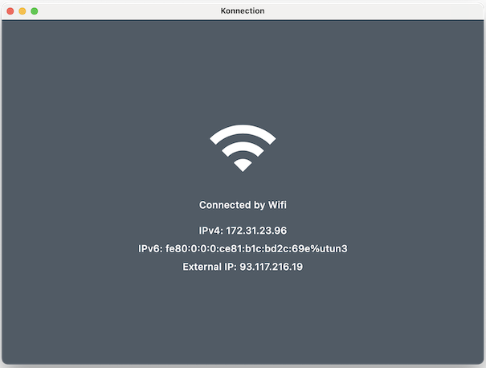

# Konnection

A Kotlin Multiplatform Mobile library to emit Network Connection status.

 



## Add to your project

### build.gradle.kts
```groovy
repositories {
    mavenCentral()
}

dependencies {
    implementation("dev.tmapps:konnection:1.4.1")
}
```

### Multiplatform (Common, JVM, Android, iOS)
In common code that should get compiled for different platforms, you can add dependency right to the `commonMain` source set:
```groovy
commonMain {
    dependencies {
        // works as common dependency as well as the platform one
        implementation("dev.tmapps:konnection:1.4.1")
    }
}
```

## Usage

### on Kotlin common code
Get a default Konnection instance.
```kotlin
val konnection = Konnection.instance
```
or create an specific instance, setting some parameters.
- `ipResolvers` is optional, but you can pass a list of your own implementations.
<br/>Konnection will iterate over the provided list and returns the ip info for the first result, or null in case no results.
```kotlin
val konnection = Konnection.createInstance(enableDebugLog = true, ipResolvers = listOf(...))
```
An IpResolver, as the name auto-explain, is a class that knows how to resolve the ip info
for the available connection, useful to get the connection External Ip info.
<br/><br/>
The library already provide 2 default implementations:
- **MyExternalIpResolver**: https://myexternalip.com/raw
- **IPv6TestIpResolver**: https://v4v6.ipv6-test.com/api/myip.php
<br/>
> **NOTE**: It is strongly recommended to work with only one Konnection instance on the App.

To get the immediate connection state.

```kotlin
val hasNetworkConnection = konnection.isConnected()
```
or observe it...
```kotlin
konnection.observeHasConnection()
    .collect { hasConnection -> ... }
```
Returns ip info for Wifi (ipv4 and ipv6) and Mobile (host and external) connections
```kotlin
val currentIpInfo = konnection.getCurrentIpInfo()
```
Observes current NetworkConnection state (WIFI, MOBILE, ETHERNET or null).
```kotlin
konnection.observeConnection()
    .collect { state -> ... }
```

### on Android
It's possible to create a Konnection single instance with a specific `android.content.Context` instance.
``` kotlin
val konnection = Konnection.createInstance(context, ...)
```

### on iOS
Get or create a Konnection instance as explained at [on Kotlin common code](#on-Kotlin-common-code) section.

Create Swift friendly APIs on Kotlin iOS source code.
```kotlin
fun hasConnectionObservation(callback: (Boolean) -> Unit) {
    Konnection.instance.observeHasConnection()
        .onEach { callback(it) }
        .launchIn(...)
}

fun networkConnectionObservation(callback: (NetworkConnection?) -> Unit) {
    Konnection.instance.observeNetworkConnection()
        .onEach { callback(it) }
        .launchIn(...)
}

fun stopKonnection() = Konnection.instance.stop()

```

To stop the publishing of connection state, it's necessary to stop the Konnection instance before the Application terminate.
<br/>Call the `stopKonnection` function on the `applicationWillTerminate` of your AppDelegate.

The Konnection stop will also clear the internal library reference and free the created pointers on native heap memory.

### on JVM
It's possible to create a Konnection single instance with some extra parameters.
- `connectionCheckTime = [duration]`: allow the control of the check connection time.
- `pingHostCheckers`: list of hosts to ping on connection check, eg. "google.com", "apple.com", ...
```kotlin
val konnection = Konnection.createInstance(
    connectionCheckTime = 5.seconds,
    pingHostCheckers = listOf("myhost.com"),
    ...
)
```

### Connection Type by Platforms

The following table defines the possible values per supported platform:

| Connection Type     | Android  | iOS      | JVM |
|---------------------|:--------:|:--------:|:---:|
| Wifi                | ✅       | ✅       | ✅   |
| Mobile              | ✅       | ✅       | ❌   |
| Ethernet            | ✅       | ✅       | ✅   |
| Bluetooth Tethering | ✅       | ❌       | ❌   |
| Unknown             | ✅       | ✅       | ❌   |

> **Unknown** type means there is some internet connection detected but the type is unknown.

## License

    Copyright 2021 TMApps
    
    Licensed under the Apache License, Version 2.0 (the "License");
    you may not use this file except in compliance with the License.
    You may obtain a copy of the License at
    
       http://www.apache.org/licenses/LICENSE-2.0
    
    Unless required by applicable law or agreed to in writing, software
    distributed under the License is distributed on an "AS IS" BASIS,
    WITHOUT WARRANTIES OR CONDITIONS OF ANY KIND, either express or implied.
    See the License for the specific language governing permissions and
    limitations under the License.